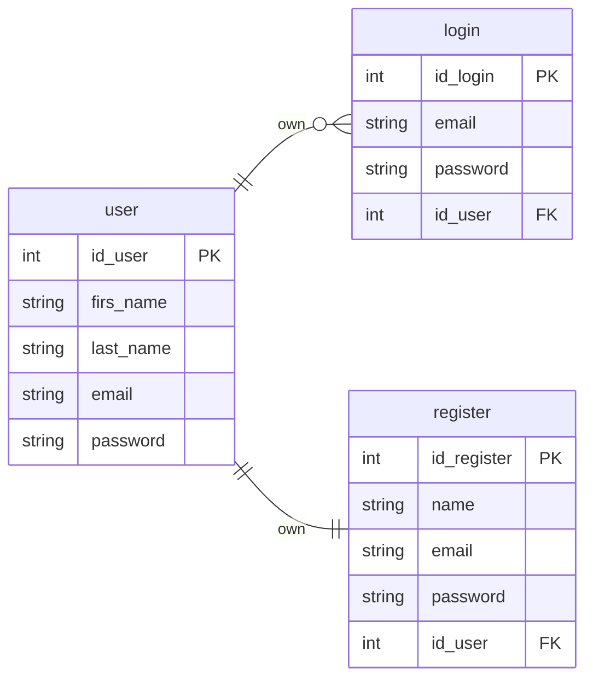

## create auth login flow

```mermaid

erDiagram
direction LR
user ||--o{ login :own
user ||--|| register :own

user{
    int id_user PK
    string firs_name
    string last_name
    string email
    string password
}

login{
    int id_login PK
    string email
    string password
    int id_user FK
}

register{
    int id_register PK
    string name
    string email
    string password
    int id_user FK
}


```
