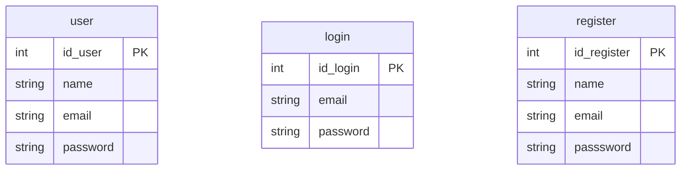

```mermaid

erDiagram

user{
    int id_user PK
    string name
    string email
    string password
}

login{
    int id_login PK
    string email
    string password
}

register{
    int id_register PK
    string name
    string email
    string passsword
}


```
