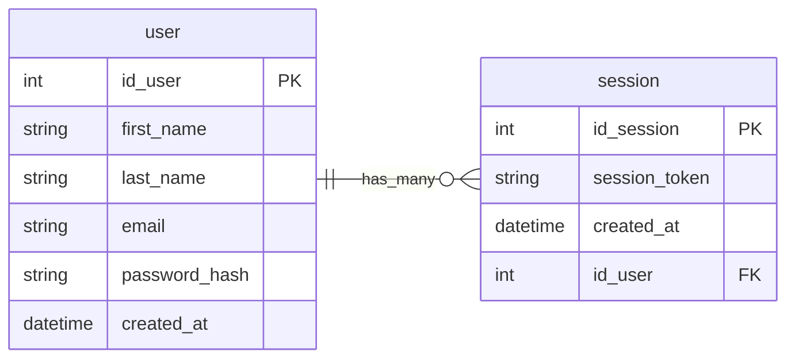

## create auth login flow

```mermaid

erDiagram
direction LR
user ||--o{ session :has_many

user{
    int id_user PK
    string first_name
    string last_name
    string email
    string password_hash
    datetime created_at
}

session{
    int id_session PK
    string session_token
    datetime created_at
    int id_user FK
}


```
